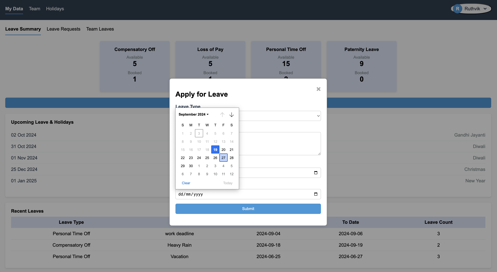

# Leave Management System

This project is a Leave Management System designed to help employees manage their leaves, view leave summaries, and track team leaves.

### Planned/Not Yet Implemented Features
1. **Leave Request Validation Against Weekends and Holidays**
2. **Team Summary with Leaves Left**
3. **Availability Check During Leave Application**
4. **Email Notifications**

## Screenshots

### 1. Login Page
This screenshot shows the login page for the application, where users can enter their credentials to access the system.


### 2. Login with Wrong Credentials
This screenshot shows the response when a user tries to log in with incorrect credentials.


### 3. Female Summary View
This screenshot shows the leave summary view for a female employee, detailing available and used leaves.


### 4. Male Summary View
This screenshot shows the leave summary view for a male employee, detailing available and used leaves.


### 5. Date Validation
This screenshot demonstrates the date validation feature, ensuring users cannot select past dates or weekends.



### 6. Summary
This screenshot provides an overview of the leave summary, showing the different types of leaves available and their respective counts.


### 7. My Leaves
This screenshot displays the "My Leaves" section where users can view their recent leave requests and their statuses.


### 6. Team Leaves
This section will show the "Team Leaves" section where managers can view and manage their team's leave requests.


## How to Run the Project

1. Clone the repository:
    ```bash
    git clone https://github.com/MaheshReddy-05/Leave-Management.git
    ```
2. Navigate to the project directory:
    ```bash
    cd Leave-Management
    ```
